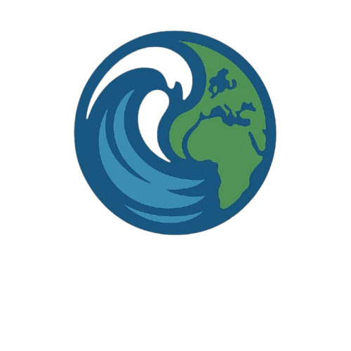

# 🌳 Clima Ação - Landing Page

Bem-vindo ao repositório oficial da landing page da **Clima Ação**, uma ONG fictícia (ou real, dependendo do seu caso) dedicada a conscientizar e mobilizar a sociedade contra os impactos das mudanças climáticas.

O nosso lema é: **"O futuro depende das ações de hoje."**

Esta landing page serve como o principal ponto de contacto digital para apresentar nossa missão, nossos projetos e angariar apoio para a causa climática.

## 🚀 Propósito do Projeto

Este projeto é uma landing page completa, desenvolvida para apresentar de forma clara e impactante os objetivos e áreas de atuação da ONG. O site é totalmente responsivo e inclui diversas seções interativas.

## ✨ Seções Principais (Features)

A landing page está estruturada nas seguintes seções:

* **Início:** Uma seção "hero" com vídeo de fundo e a principal chamada para ação (CTA).
* **Sobre Nós:** Apresenta a missão, visão e valores da Clima Ação.
* **Timeline do Clima:** Uma timeline horizontal interativa (slider) mostrando marcos históricos das mudanças climáticas.
* **Projetos e Ações:** Descreve as frentes de atuação da ONG, como Educação Climática, Redução de Carbono e Monitoramento.
* **Resultados:** Mostra o impacto concreto das ações em números (ex: escolas impactadas, CO₂ evitado).
* **Depoimentos:** Histórias de impacto de pessoas beneficiadas pelos projetos.
* **Blog/Notícias:** Exibe as últimas notícias e artigos sobre o tema.
* **Impacto (Mapa):** Um mapa interativo (Leaflet.js) que mostra os locais dos projetos da ONG.
* **Como Ajudar:** Seção com cards que direcionam o utilizador para Doação, Voluntariado ou Parceria.
* **Contato:** Um formulário de contato funcional.
* **ClimaBot:** Um chatbot assistente para tirar dúvidas dos visitantes.

## 🛠️ Tecnologias Utilizadas

Este projeto foi construído utilizando as seguintes tecnologias:

* **HTML5:** Para a estrutura semântica do site.
* **Tailwind CSS (via CDN):** Framework CSS utility-first para um design rápido e responsivo.
* **CSS3 Customizado:** Um ficheiro `style.css` para componentes complexos e animações personalizadas (como os tooltips da equipe, cards da timeline, etc.).
* **JavaScript (ES6+):** Para toda a interatividade do site, incluindo:
    * Menu móvel (hambúrguer).
    * Animações de texto (GSAP).
    * Modais de formulário (Doação, Voluntário, etc.).
* **[Swiper.js](https://swiperjs.com/):** Para o slider da "Timeline do Clima".
* **[Leaflet.js](https://leafletjs.com/):** Para o mapa interativo na seção de impacto.
* **[AOS (Animate On Scroll)](https://michalsnik.github.io/aos/):** Para as animações de "fade" e "slide" dos elementos ao rolar a página.
* **[GSAP (GreenSock Animation Platform)](https://greensock.com/gsap/):** Para a animação das palavras no título principal.

## 🤝 Como Contribuir

No momento, este repositório serve como um portfólio. Contudo, se esta fosse uma ONG real, as contribuições poderiam ser feitas através de:

1.  **Doações:** Através do modal de doação na seção "Como Ajudar".
2.  **Voluntariado:** Inscrevendo-se através do formulário de voluntariado.
3.  **Sugestões no Código:** Abrindo uma "Issue" (problema) ou enviando um "Pull Request" (sugestão de mudança) neste repositório.

---

_README.md criado com a ajuda do Parceiro de Programação._